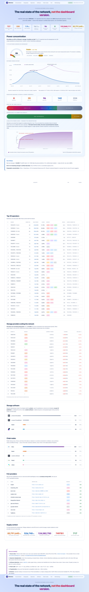

<div align="center">


# filcensus

**Filecoin Network Intelligence — the real state of the network, not the dashboard version.**

[**Live dashboard → filcensus.reiers.io**](https://filcensus.reiers.io)

[](LICENSE)


</div>

---

filcensus is a measured, public snapshot of who actually runs the Filecoin storage network. It deduplicates miner IDs into real operators, classifies the daemon each one runs, geo-locates the infrastructure, tracks growth and decline, and surfaces the FoC providers actually serving traffic.

It exists because the headline numbers everyone repeats — "Filecoin has X miners storing Y EiB" — are wrong. Most of those miner IDs are ghosts. Most of that storage is one operator running 50 IDs. Most of the QAP is a 10× verified-deal multiplier hiding the physical decline.

> **330 operators run the active Filecoin storage layer.**  
> **8 operators control 50% of raw storage. 96 control 90%.**  
> Raw power peaked at 16.77 EiB in July 2022. Today it's 1.9 EiB. That's an **89% decline** the QAP metric hides behind a 10× multiplier.

---

## Dashboard

<a href="https://filcensus.reiers.io">
  
</a>

The live dashboard at **[filcensus.reiers.io](https://filcensus.reiers.io)** updates every ~48h with a fresh snapshot. Every section has a thesis, not a label:

| Section | What it tells you |
|---|---|
| **Headline strip** | 8 colored stat cards — reported miner IDs, real operators, raw + QAP storage, who controls 50% / 90%, active deals, FIL pledge |
| **Power concentration** | Network growth/decline meter (CMC fear/greed style), 5-year power history chart with peak callouts, top-tier stacked bar, deal vs CC split, Lorenz cumulative curve |
| **Geographic distribution** | Donut chart + country-pill table; where the reachable miner IDs actually live by GeoIP |
| **Top operators** | 30 deduplicated operators by raw power, with country pills + sample miner IDs |
| **Storage providers exiting** | Miners losing power this measurement period, ranked by absolute loss in PiB |
| **Storage software** | What daemon each miner actually runs (Curio / Boost / lotus-miner / Venus / custom / private / no peer ID) |
| **Chain nodes** | Public Lotus / Forest / Venus full nodes our daemon is connected to via libp2p |
| **FoC providers** | Healthy-only list of PDP services from the on-chain ServiceProviderRegistry |
| **Supply context** | Pledge collateral, market collateral, DataCap allocations |

## What it tracks

- **Active SPs** — software, version, peer ID, multiaddrs, IP, ASN, country, raw + QA power, sector size, owner / worker / control / beneficiary addresses
- **Operators** — miner IDs deduplicated by union-find on shared identity signals (owner, worker, control, beneficiary, IP); **the real shape of the network**
- **Power deltas** — per-miner gain/loss between Filfox measurement periods, surfaced as the "exiting the network" section and aggregated into the growth meter
- **Chain nodes** — directly-connected full-node fleet via `NetPeers` + `NetAgentVersion`
- **FoC providers** — every PDP service registered on the on-chain `ServiceProviderRegistry` contract, with live `serviceURL/pdp/ping` health check
- **Geography & ASN concentration** — power-weighted, per country and per ASN
- **Network truth** — chain-aggregate readouts from the `f04` / `f05` / `f06` system actors: total power, total pledge, total deals, total DataCap allocations
- **Power history** — 5+ years of quarterly raw + QA EiB readings, with today's snapshot appended live

## Detection signatures

All software classification is verified against upstream `main` branches:

| Software | Source | Agent string |
|---|---|---|
| **Lotus** | `lotus/build/buildconstants/params.go` (`UserAgent = "lotus"`) | `lotus-<version>` |
| **Forest** | `forest/src/libp2p/discovery.rs` (`with_agent_version("forest-{...}")`) | `forest-<version>+git.<hash>` |
| **Venus** | `venus/app/submodule/network/network_submodule.go` (`libp2p.UserAgent("venus")`) | `venus` |
| **Curio** | curio repo libp2p init | `curio-<version>` |
| **Boost** | boostd libp2p init | `boost-<version>` |

All of them announce `ipfs/0.1.0` as the libp2p identify protocol; one dial covers the whole fleet.

## On-chain contracts (mainnet)

| Contract | Address |
|---|---|
| ServiceProviderRegistry | `0xf55dDbf63F1b55c3F1D4FA7e339a68AB7b64A5eB` |
| FilecoinWarmStorageService (FWSS) | `0x8408502033C418E1bbC97cE9ac48E5528F371A9f` |
| PDPVerifier | `0xBADd0B92C1c71d02E7d520f64c0876538fa2557F` |

(Verified from `@filoz/synapse-core/abis/generated.ts`, 2026-05-06.)

## Architecture

```
┌──────────────────────────────────┐
│ Mainnet Lotus node (Nicklas's)    │
│  - filcensus census               │
│  - filcensus push                 │  → POST snapshot.json over HTTPS
└────────────┬─────────────────────┘
             │ TLS, bearer auth
             ▼
┌──────────────────────────────────┐
│ Hetzner host                      │
│  nginx (TLS, vhost routing)       │
│   ├── filcensus.reiers.io        │
│   └── ingest.filcensus.reiers.io │
│  filcensusd (127.0.0.1:8770)     │
│   - validates SHA256 + schema    │
│   - atomic write                 │
│   - re-renders dashboard         │
└──────────────────────────────────┘
```

The mainnet node never reads from the dashboard host. One-way data push only. Full deploy guide in [`deploy/README.md`](deploy/README.md).

## Internal packages

- [`internal/detect`](internal/detect/) — agent-string + protocol classifier (24 unit tests)
- [`internal/snapshot`](internal/snapshot/) — versioned JSON file format, atomic writes
- [`internal/foc`](internal/foc/) — ServiceProviderRegistry enumeration via real keccak selectors + full ABI tuple decoder (11 tests)
- [`internal/spscan`](internal/spscan/) — SP enumeration via Filfox + libp2p probe
- [`internal/cluster`](internal/cluster/) — union-find dedup of miner IDs into operators (7 tests)
- [`internal/networktruth`](internal/networktruth/) — `f04` / `f05` / `f06` actor reads + active-deal binary search
- [`internal/chaincrawl`](internal/chaincrawl/) — `NetPeers` + `NetAgentVersion` chain-node enumeration (2 tests)
- [`internal/geoip`](internal/geoip/) — db-ip.com free GeoLite2-compatible mmdb wrapper + cache (3 tests)
- [`internal/probe`](internal/probe/) — HTTP `/pdp/ping` prober (6 tests)
- [`internal/render`](internal/render/) — embedded static dashboard renderer (light theme, glass panels, SVG charts)

## Quick start

```bash
git clone https://github.com/Reiers/sp-radar.git
cd sp-radar
go build -o filcensus ./cmd/filcensus

# Smoke test on calibration via Glif (no auth needed)
export FULLNODE_API_INFO="https://api.calibration.node.glif.io/rpc/v1"
./filcensus foc-count --network calibration

# Calibration census + render (no GeoIP, no chain nodes — anonymous-friendly)
./filcensus census --network calibration --skip-sps --skip-chain-nodes \
  --out snapshots --render site

open site/index.html
```

## Full mainnet snapshot

Designed to run on a host with a local Lotus mainnet node (NetPeers + authenticated EthCall require it). Total runtime: **~1m30s per snapshot** (was ~2m before adding the active-deal binary search).

```bash
export FULLNODE_API_INFO="<token>:/ip4/127.0.0.1/tcp/1234/http"
export MAXMIND_CITY_DB=/var/lib/GeoIP/GeoLite2-City.mmdb
export MAXMIND_ASN_DB=/var/lib/GeoIP/GeoLite2-ASN.mmdb

./filcensus census \
  --network mainnet \
  --concurrency 50 \
  --out snapshots \
  --render site \
  --with-geoip
```

GeoIP databases come from [db-ip.com free monthly snapshots](https://db-ip.com/db/lite.php) (GeoLite2-compatible mmdb, no API key required). The `enrich` subcommand can attach GeoIP to an existing snapshot post-fact:

```bash
./filcensus enrich snapshots/mainnet-2026-05-06.json
```

## Cadence

Manually triggered every ~48h. Each snapshot:
1. Network truth from `f04` / `f05` / `f06` actors (~3s, ~30 cheap RPCs)
2. Active SPs from Filfox `/miner/list/power` (~5s, paginated)
3. FoC providers from `ServiceProviderRegistry` (~30s)
4. libp2p probe of every active SP (~30-60s, 50-way concurrent)
5. `NetPeers` + `NetAgentVersion` chain-node walk (~30s)
6. HTTP probe of every FoC `serviceURL/pdp/ping` (~1 min, parallel)
7. GeoIP enrichment (~1s, in-memory MaxMind lookups)
8. Operator dedup via union-find (~ms)
9. Snapshot JSON write + dashboard render

## Privacy

We read what nodes broadcast publicly via libp2p `identify`, chain-published multiaddrs, and on-chain registry entries. No exploitation, no auth bypass, no private endpoints. Operators who want to be invisible should not advertise public dial addrs on chain. Opt-out by emailing the maintainer — we'll exclude your peer ID from the published version (still counted in aggregates).

## Status

- [x] All 9 internal packages built + tested
- [x] First mainnet snapshot rendered live at filcensus.reiers.io
- [x] Hetzner deploy: nginx + Let's Encrypt + systemd + push-only ingest
- [x] Dashboard: light theme, glass panels, network sentiment meter, 5-year power history, Lorenz curve, declining-SPs section, FoC healthy-only filter
- [ ] Historical trend lines (we have today's snapshot vs prior; need to wire daily diff into the snapshot store)
- [ ] Operator naming heuristics (entity-name resolution beyond chain-truth-only dedup)
- [ ] Public RSS feed of large operator changes

## License

MIT — see [`LICENSE`](LICENSE).

---

<div align="center">

**TSE Reiersen** · Org 929 074 912 · [reiers.io](https://reiers.io)

</div>
